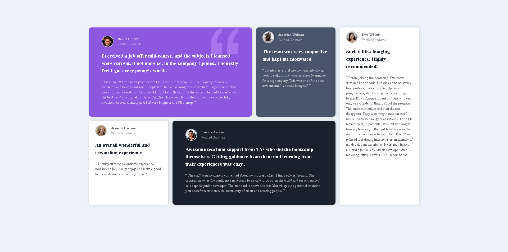

# Frontend Mentor - Testimonials grid section solution

This is a solution to the [Testimonials grid section challenge on Frontend Mentor](https://www.frontendmentor.io/challenges/testimonials-grid-section-Nnw6J7Un7). Frontend Mentor challenges help you improve your coding skills by building realistic projects. 

## Table of contents

  - [The challenge](#the-challenge)
  - [Screenshot](#screenshot)
  - [Links](#links)
  - [Built with](#built-with)
  - [What I learned](#what-i-learned)
  - [Continued development](#continued-development)
  - [Useful resources](#useful-resources)
- [Author](#author)

## Overview

### The challenge

Users should be able to:

- View the optimal layout for the site depending on their device's screen size

### Screenshot

### Links

- Live Site URL: [Live site](https://grid-testimonials-sage.netlify.app/)

### Built with

- Semantic HTML5 markup
- CSS custom properties
- Flexbox
- CSS Grid
- Mobile-first workflow

### What I learned

This project help me to understand more about grid layout and how to effective use the grip-template-area for responsive website design

### Continued development

While continue on my path to become a great full stack developer, i will grow my responsive design skills by learning more about the grid layout

### Useful resources

- [web.dev website](https://web.dev/learn/css/grid?continue=https%3A%2F%2Fweb.dev%2Flearn%2Fcss%23article-https%3A%2F%2Fweb.dev%2Flearn%2Fcss%2Fgrid) 

## Author

- Frontend Mentor - [@Jerryhugo](https://www.frontendmentor.io/profile/Jerryhugo)
- Twitter - [sage.dev](https://www.twitter.com/insp_family)
